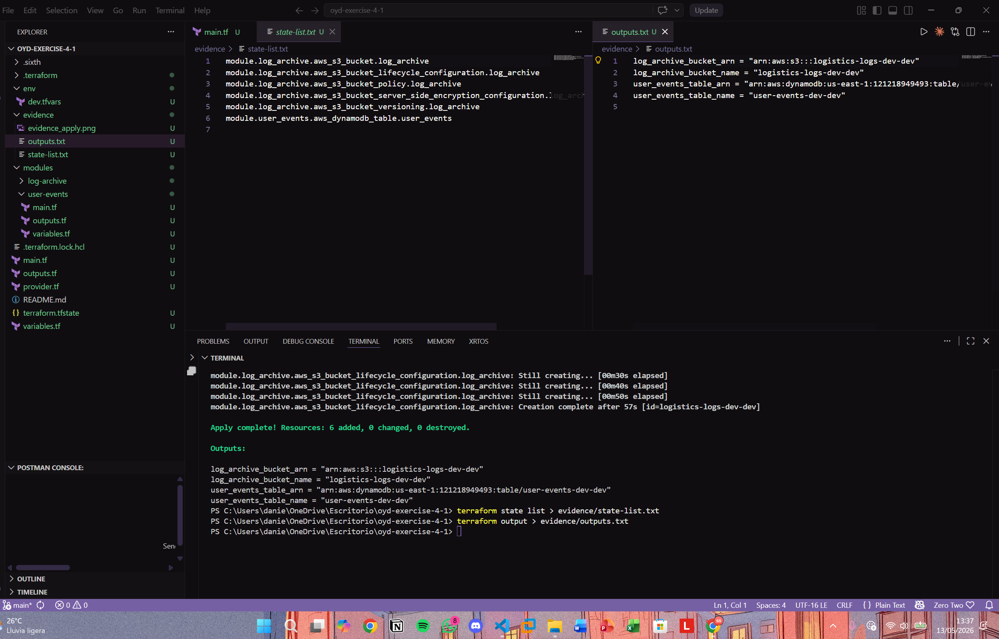
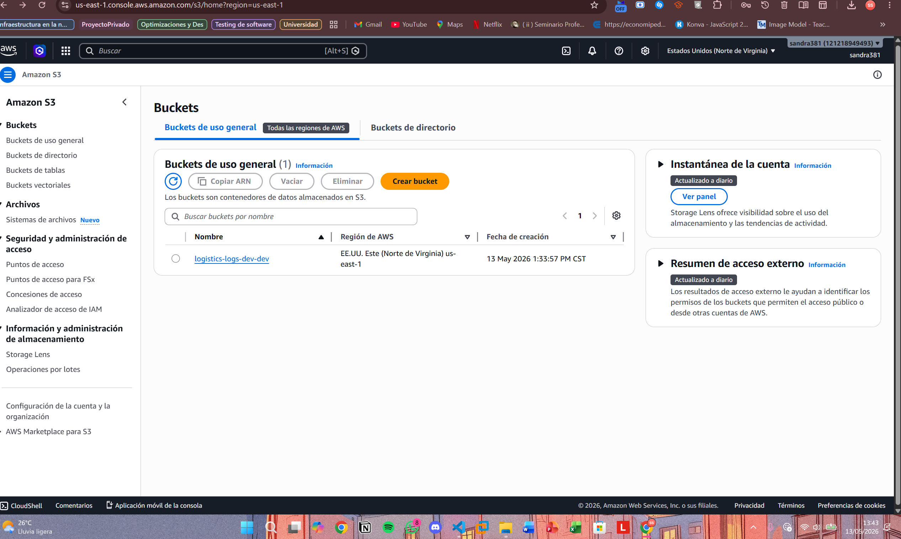
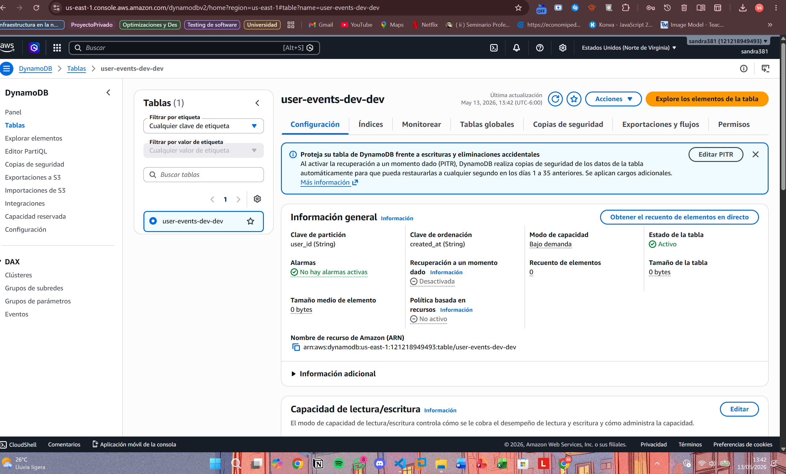

# oyd-exercise-4-1

Módulos de Terraform para una plataforma de logística: archivo de logs en S3 y eventos de usuario en DynamoDB.

## Descripción

Este proyecto contiene dos módulos reutilizables de Terraform desarrollados como parte del curso Optimizaciones y Desempeño — Cloud Deployment Automation.

- **log-archive**: Crea un bucket S3 con versionado, regla de ciclo de vida, encriptación SSE-S3 y política que bloquea conexiones no-HTTPS.
- **user-events**: Crea una tabla DynamoDB con índice secundario global (GSI), TTL y encriptación activada.

## Estructura del proyecto

```
oyd-exercise-4-1/
├── provider.tf
├── main.tf
├── variables.tf
├── outputs.tf
├── env/
    ├──dev.tfvars
├── modules/
│   ├── log-archive/
│   │   ├── variables.tf
│   │   ├── main.tf
│   │   └── outputs.tf
│   └── user-events/
│       ├── variables.tf
│       ├── main.tf
│       └── outputs.tf
└── evidence/
    ├── state-list.txt
    └── outputs.txt
```

## Requisitos previos

- Terraform >= 1.8
- AWS CLI configurado con credenciales válidas para crear buckets S3 y tablas DynamoDB

## Uso

```bash
terraform init
terraform fmt -recursive
terraform validate
terraform apply -var-file=terraform.tfvars
```

## Módulos

### log-archive

| Variable | Tipo | Descripción |
|---|---|---|
| `bucket_name` | string | Nombre base del bucket S3 |
| `environment` | string | Ambiente de despliegue |
| `log_prefix` | string | Prefijo para la regla de ciclo de vida (default: `logs/`) |

| Output | Descripción |
|---|---|
| `bucket_arn` | ARN del bucket S3 |
| `bucket_name` | Nombre del bucket S3 |

### user-events

| Variable | Tipo | Descripción |
|---|---|---|
| `table_name` | string | Nombre base de la tabla DynamoDB |
| `environment` | string | Ambiente de despliegue |

| Output | Descripción |
|---|---|
| `table_name` | Nombre de la tabla DynamoDB |
| `table_arn` | ARN de la tabla DynamoDB |

## Evidence

### terraform state list

```
module.log_archive.aws_s3_bucket.log_archive
module.log_archive.aws_s3_bucket_lifecycle_configuration.log_archive
module.log_archive.aws_s3_bucket_policy.log_archive
module.log_archive.aws_s3_bucket_server_side_encryption_configuration.log_archive
module.log_archive.aws_s3_bucket_versioning.log_archive
module.user_events.aws_dynamodb_table.user_events
```
[Evidencia de state list](evidence/state-list.txt)

### terraform output

```
log_archive_bucket_arn = "arn:aws:s3:::logistics-logs-dev-dev"
log_archive_bucket_name = "logistics-logs-dev-dev"
user_events_table_arn = "arn:aws:dynamodb:us-east-1:121218949493:table/user-events-dev-dev"
user_events_table_name = "user-events-dev-dev"
```
[Evidencia del output](evidence/outputs.txt)




